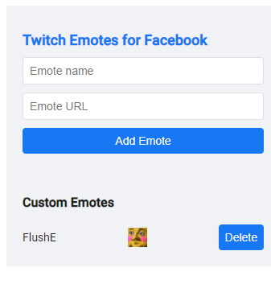
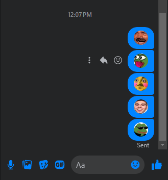

# Twitch Emotes for Facebook

Twitch Emotes for Facebook is a Chrome extension that enhances your Facebook experience by replacing specific text with Twitch emotes. You can also add custom emotes to personalize your interactions.

## Features

- **Text Replacement**: Automatically replaces predefined text with Twitch emotes on Facebook.
- **Custom Emotes**: Add and use your custom emotes.

## Installation

1. Clone the repository or download the ZIP file.
2. Open Chrome and go to `chrome://extensions/`.
3. Enable `Developer mode`.
4. Click `Load unpacked` and select the extension's directory.

## Important Notes

- **Emote URLs**: Due to Content Security Policy (CSP) restrictions, you must use URLs from certain domains. Only URLs from the following domains are allowed:
  - `fbcdn.net`
  - `facebook.com`
  - `fbsbx.com`
  - `cdninstagram.com`
  - `whatsapp.net`
  - `fb.com`
  - `oculuscdn.com`
  - `tenor.co`
  - `tenor.com`
  - `giphy.com`
- **Uploading Emotes**: To use custom emotes, you need to upload them as posts on Facebook to get a valid URL.

## Screenshots

### Adding Emotes

### Emotes in Action

## Contributing

1. Fork the repository.
2. Create a new branch (`git checkout -b feature/YourFeature`).
3. Commit your changes (`git commit -m 'Add new feature'`).
4. Push to the branch (`git push origin feature/YourFeature`).
5. Open a pull request.

